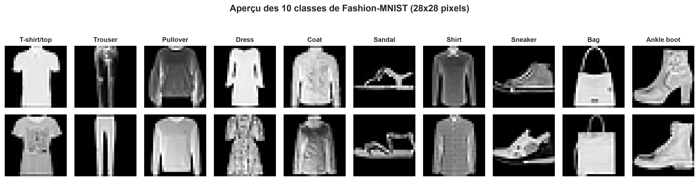
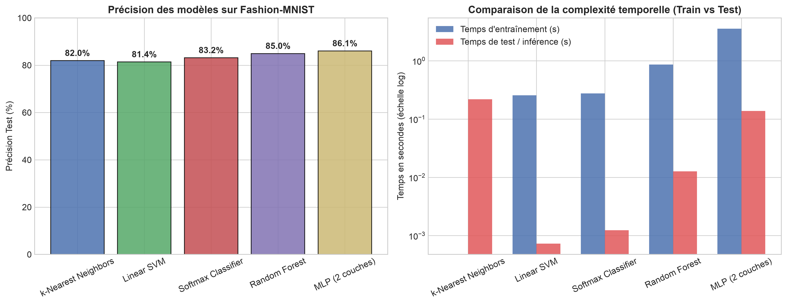
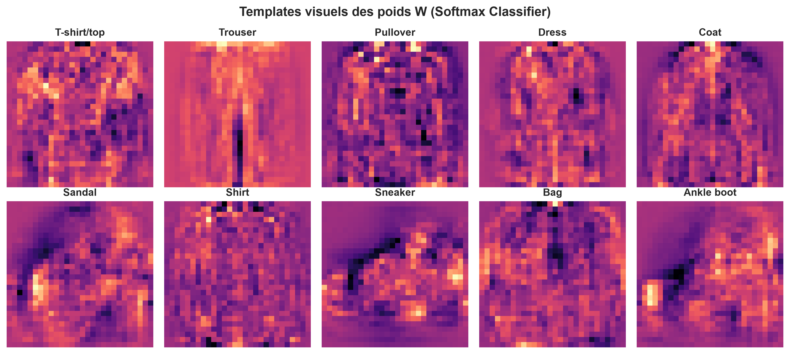
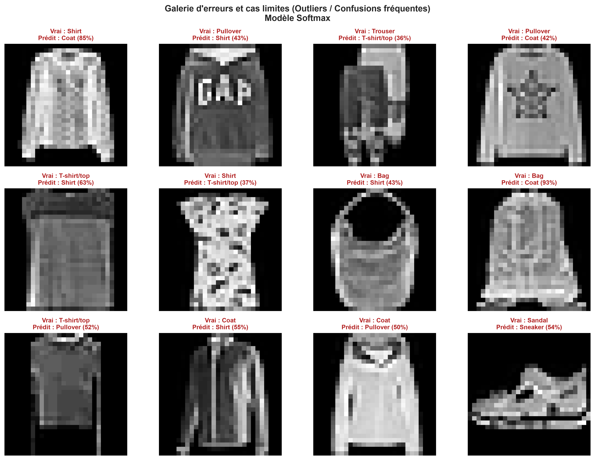

# 📊 Rapport d'Expérimentation : Benchmark de Classification d'Images

Ce document synthétise les résultats de notre benchmark comparatif sur le jeu de données **Fashion-MNIST** (10 classes d'articles de mode en niveaux de gris $28 \times 28$).

Conformément aux cours 1 et 2 de **Stanford CS231n**, nous comparons des méthodes d'apprentissage classiques (sans paramètres / mémoire de données), des classifieurs linéaires paramétriques optimisés *from scratch*, des modèles d'arbres ensemblistes, et un réseau de neurones multicouche (Deep Learning).

---

## 🖼️ 1. Le Jeu de Données : Fashion-MNIST

Fashion-MNIST remplace le dataset classique MNIST des chiffres manuscrits pour offrir un défi visuel réaliste tout en conservant une taille compacte ($28 \times 28$).

- **Nombre d'échantillons d'entraînement** : 10 000
- **Nombre d'échantillons de test** : 2 000
- **Dimensions de chaque image** : $28 \times 28 = 784$ caractéristiques
- **Nombre de classes** : 10 (T-shirt/top, Trouser, Pullover, Dress, Coat, Sandal, Shirt, Sneaker, Bag, Ankle boot)

---

## 🏆 2. Tableau Récapitulatif des Performances

| Modèle | Type d'Approche | Précision Test | Temps Train | Temps Test (Inférence) |
| :--- | :--- | :---: | :---: | :---: |
| **k-Nearest Neighbors** | Instance-based (From Scratch) | **81.95 %** | 0.00 s | 0.2190 s |
| **Linear SVM** | Classifieur Linéaire (From Scratch) | **81.40 %** | 0.26 s | 0.0007 s |
| **Softmax Classifier** | Classifieur Linéaire (From Scratch) | **83.15 %** | 0.28 s | 0.0012 s |
| **Random Forest** | Ensemble d'arbres (scikit-learn) | **84.95 %** | 0.86 s | 0.0127 s |
| **MLP (2 couches)** | Réseau de neurones (PyTorch) | **86.05 %** | 3.55 s | 0.1377 s |

---

## 📈 3. Analyse Temporelle & Compromis Précision / Vitesse

### Enseignement fondamental de CS231n (Le paradoxe du kNN) :
1. **k-Nearest Neighbors (kNN)** :
   - **Entraînement instantané** ($\mathcal{O}(1)$) : Il se contente de mémoriser les données sans calcul de paramètres.
   - **Inférence prohibitif** ($\mathcal{O}(N \cdot D)$) : Pour classer une seule image de test, il doit calculer sa distance euclidienne avec l'ensemble des 10 000 images d'entraînement. En vision par ordinateur embarquée (voiture autonome, smartphone), un test lent est rédhibitoire.
2. **Modèles Paramétriques (Linear SVM, Softmax, MLP)** :
   - **Entraînement coûteux** : Recherche de paramètres optimaux $(W, b)$ via descente de gradient stochastique (SGD/Adam).
   - **Inférence instantanée** ($\mathcal{O}(D)$) : Une simple multiplication matrice-vecteur $s = Wx + b$, idéale pour la production.

---

## 👁️ 4. Les Templates Visuels des Poids $W$ (Interprétation du Cours 2)

L'un des enseignements majeurs du Cours 2 de CS231n est la **vision par template** d'un classifieur linéaire : chaque ligne de la matrice $W \in \mathbb{R}^{10 \times 784}$ correspond à un gabarit prototype moyen appris pour chaque classe.

### Que voit le modèle ?
- **Pantalon (Trouser)** : Les poids activent très fortement les deux colonnes verticales centrales (jambes) et pénalisent les pixels sur les côtés.
- **T-shirt vs Pull (Pullover)** : Le template du T-shirt se concentre sur les manches courtes, tandis que le Pullover capture des manches longues épaisses.
- **Bottine (Ankle boot) vs Basket (Sneaker)** : Le template de la bottine affiche une collerette haute caractéristique pour la cheville.

> **Limite intrinsèque du classifieur linéaire** : Chaque classe ne dispose que d'un **seul template moyen**. Si un article se présente sous deux angles différents (ex: chaussure vue de profil vs vue de dessus, ou cheval regardant à gauche vs à droite), le modèle linéaire échoue car il tente de faire une moyenne floue des deux modes. C'est la raison pour laquelle nous avons besoin de réseaux profonds multi-couches.

---

## 🚨 5. Galerie d'Erreurs & Outliers Typiques

Pourquoi les modèles se trompent-ils ? L'analyse qualitative des erreurs permet d'identifier l'**écart sémantique (*semantic gap*)** :

### Les confusions les plus récurrentes :
1. **Pull (Pullover) $\leftrightarrow$ Manteau (Coat) $\leftrightarrow$ Chemise (Shirt)** :
   Ces vêtements partagent une silhouette quasi-identique au niveau du torse et des bras. Les détails séparateurs (boutons, fermeture éclair, col) ne font que quelques pixels et sont atténués à une résolution de $28 \times 28$.
2. **Sandale (Sandal) $\leftrightarrow$ Basket (Sneaker)** :
   Des sandales fermées à lanières épaisses projettent une signature lumineuse très proche de sneakers basses.
3. **T-shirt $\leftrightarrow$ Robe (Dress)** :
   Certains T-shirts longs ou amples créent une forme évasée identique à une robe d'été.

---

## 💡 Conclusion & Prochaines Étapes CS231n

1. **Le MLP (Réseau de neurones 2 couches)** surpasse tous les classifieurs linéaires et les forêts aléatoires grâce à sa capacité à apprendre des représentations intermédiaires non linéaires (activation ReLU).
2. **Pour aller plus loin (Cours 5 - CNNs)** : Même le MLP traite les pixels de façon plate sans tenir compte de la géométrie locale 2D. Le prochain module introduira les **Convolutional Neural Networks (CNNs)** qui résolvent l'invariance spatiale et atteindront $> 92\%$ sur ce même problème.
