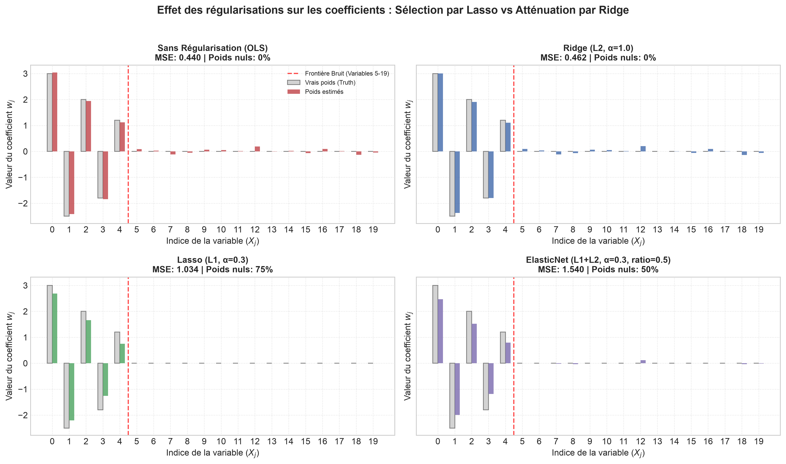
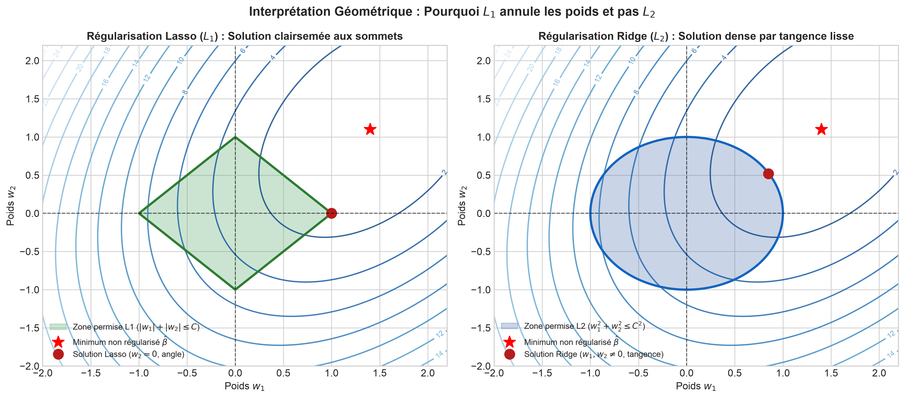
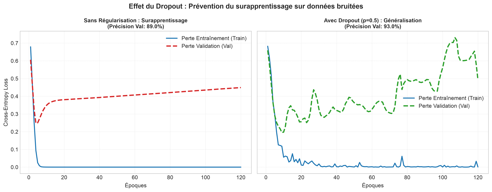

# 📓 Log 02 : Techniques de Régularisation (Lasso, Ridge, ElasticNet, Dropout)

- **Objectif** : Comparer les mécanismes mathématiques et empiriques de réduction du surapprentissage (contraintes géométriques $L_1/L_2$, sélection de variables et régularisation stochastique par Dropout).
- **Cadre** : Problèmes linéaires bruités (scikit-learn) et réseaux de neurones profonds (PyTorch).

---

## 📊 Tableau Comparatif Synthétique

| Méthode | Pénalité / Mécanisme | Impact sur les poids $w$ | Code express (scikit-learn / PyTorch) | Cas d'usage idéal |
| :--- | :--- | :--- | :--- | :--- |
| **Ridge ($L_2$)** | $\lambda \sum w_i^2$ | Réduit l'amplitude de tous les poids vers zéro sans les annuler | `Ridge(alpha=1.0)` | Multiples variables corrélées, prévient l'explosion des poids |
| **Lasso ($L_1$)** | $\lambda \sum \|w_i\|$ | Annule strictement les variables non informatives (*sparsity*) | `Lasso(alpha=0.3)` | Sélection automatique de variables, interprétabilité |
| **ElasticNet** | $\lambda_1 \|w\|_1 + \lambda_2 \|w\|_2^2$ | Compromis : sélectionne des groupes de variables corrélées | `ElasticNet(alpha=0.3, l1_ratio=0.5)` | Haute dimension avec fortes corrélations entre descripteurs |
| **Dropout** | Extinction aléatoire de neurones ($p=0.5$) | Empêche la co-adaptation complexe des neurones cachés | `nn.Dropout(p=0.5)` | Réseaux de neurones denses ou profonds sur-paramétrés |

---

## 🔍 1. Sélection de Variables & Sparsité des Poids

> **Observation** : Lasso annule strictement à zéro 100 % des variables de bruit pur (variables 5 à 19), réalisant une sélection parfaite. À l'inverse, Ridge conserve de faibles coefficients résiduels sur tout le bruit sans jamais les éteindre complètement.

---

## 📐 2. Interprétation Géométrique 2D (Pourquoi $L_1$ annule les poids)

> **Observation** : Les contours elliptiques de la perte rencontrent la boule $L_1$ en priorité sur ses pointes aiguës situées sur les axes (forçant $w_2 = 0$). Pour $L_2$, la boule circulaire lisse entraîne un point de tangence où aucune coordonnée n'est exactement nulle.

---

## ⚡ 3. Dropout sur Réseau de Neurones (Train vs Validation Loss)

> **Observation** : Sans régularisation, le modèle mémorise le bruit d'entraînement (perte train $\to 0$) pendant que l'erreur de validation diverge brutalement. Avec `Dropout(p=0.5)`, les pertes train et validation restent alignées et la précision finale grimpe de **89.0% à 93.0%**.
