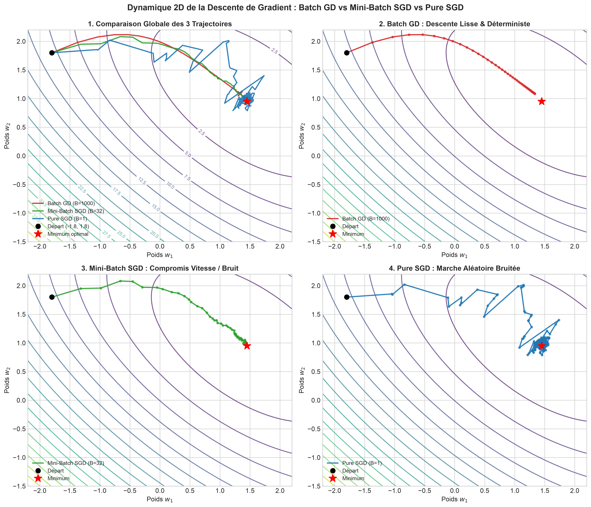
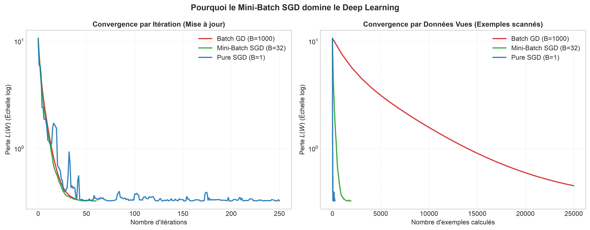

# 📓 Log 03 : Optimisation 2D — Batch GD vs Mini-Batch SGD vs Pure SGD

- **Objectif** : Visualiser en 2D sur les courbes de niveau d'une fonction de perte la différence de dynamique entre la descente de gradient classique (Full Batch), le Mini-batch SGD ($B=32$) et le SGD pur ($B=1$).
- **Référence Cours** : Stanford CS231n — Cours 3 (*Optimization & Stochastic Gradient Descent*).

---

## 📊 Tableau Comparatif des 3 Régimes d'Optimisation

| Régime | Taille du Lot ($B$) | Coût par pas | Trajectoire 2D | Avantage majeur | Limite |
| :--- | :---: | :---: | :--- | :--- | :--- |
| **Batch GD (Classique)** | $B = N$ ($1000$) | Élevé ($\mathcal{O}(N)$) | Parfaitement lisse, orthogonale aux contours | Déterministe, pas de bruit | Prohibitif sur gros datasets ($N > 10^5$) |
| **Mini-Batch SGD** | $B = 32$ | Faible ($\mathcal{O}(B)$) | Légères oscillations, descente rapide | Compromis idéal vitesse / stabilité | Nécessite de régler la taille de batch |
| **Pure SGD** | $B = 1$ | Très faible ($\mathcal{O}(1)$) | Très bruitée (marche aléatoire orientée) | Saute les minima locaux | Nécessite un learning rate décroissant |

### Code express (Vanilla Minibatch SGD — Stanford CS231n) :
```python
# Pseudo-code officiel du cours CS231n
while True:
    data_batch = sample_training_data(data, 256)        # Sous-échantillon aléatoire (batch)
    weights_grad = evaluate_gradient(loss_fun, data_batch, weights)
    weights += -step_size * weights_grad                # Mise à jour des paramètres
```

---

## 🧭 1. Comparaison Visuelle des Trajectoires 2D



> **Observation** : Batch GD suit une trajectoire idéale et directe perpendiculaire aux lignes de niveau. À l'opposé, Pure SGD ($B=1$) oscille continuellement avec une variance élevée, tandis que Mini-Batch ($B=32$) trouve le juste équilibre avec une trajectoire quasi-directe et peu perturbée.

---

## 📈 2. Vitesse de Convergence : Itérations vs Exemples Vus



> **Observation** : Par itération, Batch GD semble plus rapide car chaque pas utilise 100 % des données. Mais en observant le nombre réel d'exemples calculés, Mini-Batch SGD et Pure SGD atteignent le minimum après seulement 2 000 exemples traités, alors que Batch GD n'a même pas fini 2 époques complètes.
