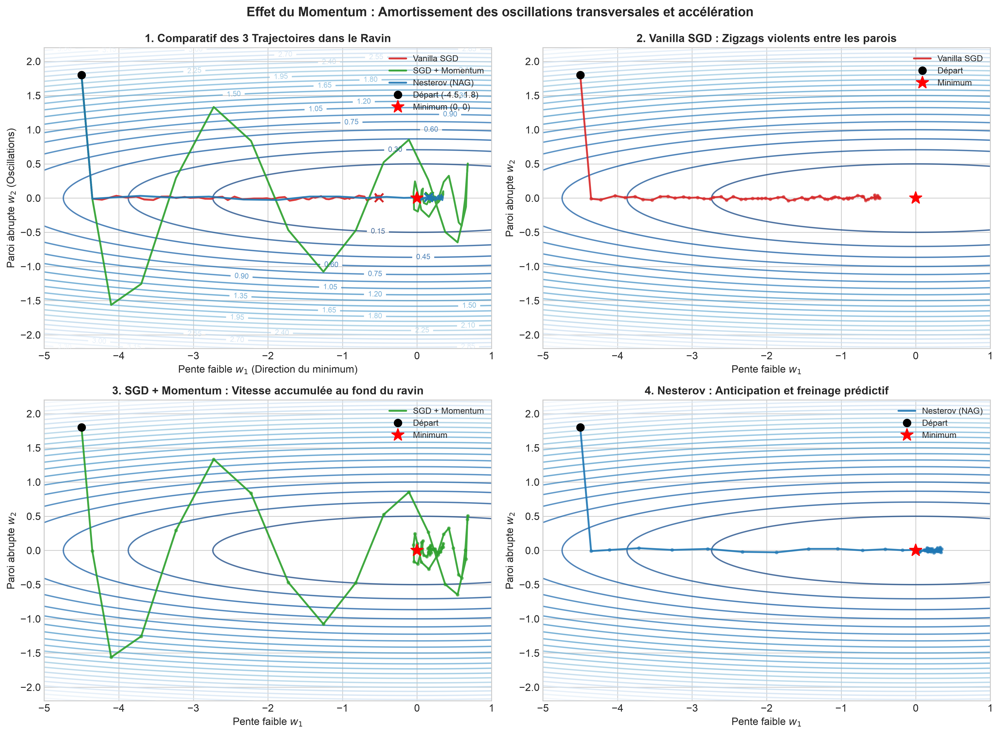
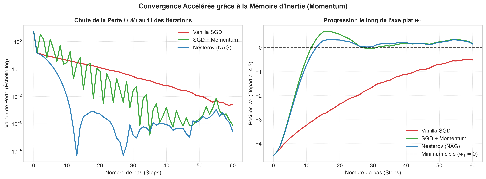

# 📓 Log 04 : SGD + Momentum & Nesterov Accelerated Gradient (NAG)

- **Objectif** : Visualiser en 2D comment le Momentum résout le blocage de SGD classique dans les ravins mal conditionnés (vallées à parois très abruptes et fond plat).
- **Référence Cours** : Stanford CS231n — Cours 3 (*Optimization & Momentum*).

---

## 📊 Tableau Comparatif des Variantes de Momentum

| Algorithme | Formulation Mathématique | Rôle de l'inertie | Comportement en ravin |
| :--- | :--- | :--- | :--- |
| **Vanilla SGD** | $w_{t+1} = w_t - \alpha \nabla L(w_t)$ | Aucune mémoire ($v=0$) | Zigzague violemment entre les parois, piétine |
| **SGD + Momentum** | $v_{t+1} = \rho v_t + \nabla L(w_t)$<br>$w_{t+1} = w_t - \alpha v_{t+1}$ | Balle lourde dévalant la pente | Les oscillations opposées s'annulent, vitesse accumulée au fond |
| **Nesterov (NAG)** | $v_{t+1} = \rho v_t + \alpha \nabla L(w_t - \rho v_t)$<br>$w_{t+1} = w_t - v_{t+1}$ | Anticipation au point futur (*lookahead*) | Freinage prédictif réduisant l'overshoot au creux de la vallée |

### Code express (CS231n — Formulation SGD Momentum & Nesterov) :
```python
# SGD + Momentum classique (rho ~ 0.9)
v = rho * v + grad
w -= learning_rate * v

# Nesterov Accelerated Gradient (NAG)
v_prev = v
v = rho * v - learning_rate * grad_lookahead
w += -rho * v_prev + (1 + rho) * v
```

---

## 🧭 1. Trajectoires 2D sur le Paysage en Ravin



> **Observation** : Vanilla SGD rebondit stérilement d'une paroi à l'autre car le gradient vertical est 30× supérieur au gradient horizontal. Avec le Momentum ($\rho=0.85$), les gradients verticaux de signes opposés s'annulent tandis que le vecteur vitesse s'aligne droit vers le minimum le long du ravin.

---

## 📈 2. Vitesse de Convergence et Avancement le long de l'Axe Plat



> **Observation** : Le Momentum et Nesterov atteignent le minimum en seulement **25 pas**, alors que Vanilla SGD est encore bloqué à mi-chemin après 60 itérations. Nesterov amortit plus rapidement les oscillations terminales au fond de la cuvette sans dépasser la cible.
