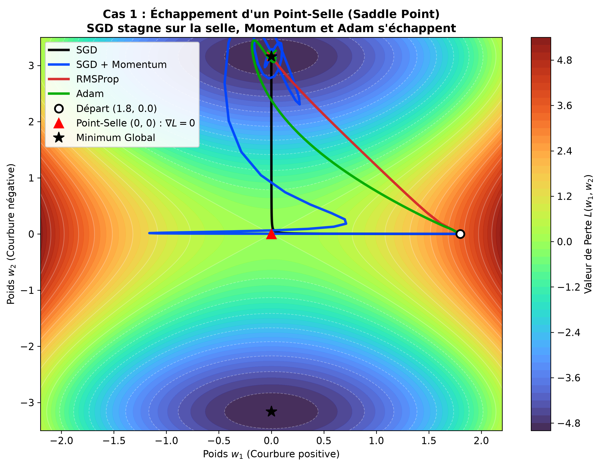
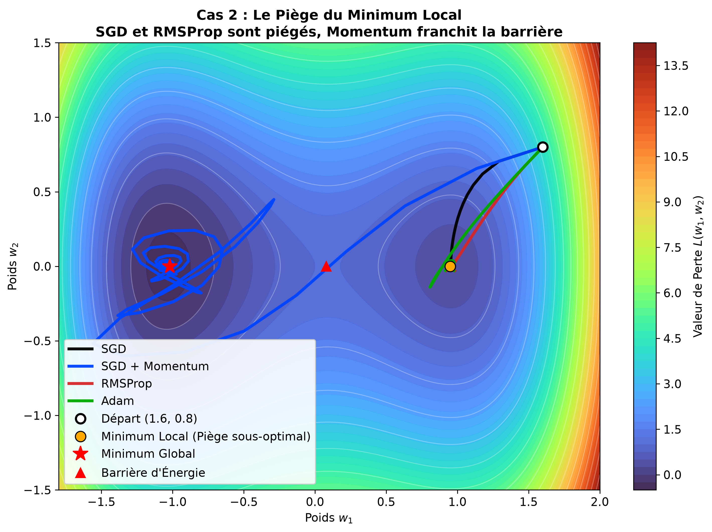
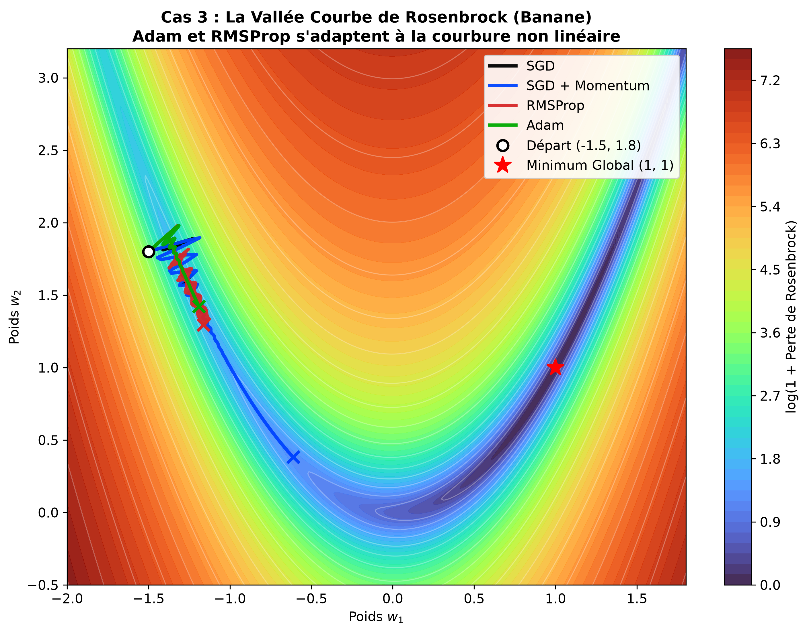

# 📓 Log 05 : Cas d'Échec de la Descente de Gradient & Optimiseurs Avancés

- **Objectif** : Visualiser en 2D sur des paysages de perte continus les cas où la descente de gradient classique échoue (point-selle, minimum local, vallée courbe de Rosenbrock) et comparer le comportement de **SGD**, **SGD + Momentum**, **RMSProp** et **Adam**.
- **Référence Cours** : Stanford CS231n — Cours 3 (*Optimization & Advanced Optimizers*).

---

## 📊 Tableau des Pièges Géométriques & Réponses des Optimiseurs

| Piège Géométrique | Définition Mathématique | Comportement de Vanilla SGD | Solution Apportée par les Optimiseurs Avancés |
| :--- | :--- | :--- | :--- |
| **Point-Selle (*Saddle Point*)** | $\nabla L = 0$, valeurs propres positives et négatives du Hessien | **Bloqué ou stagne** indéfiniment car le gradient est nul | **Momentum** et **Adam** conservent la vitesse acquise pour traverser la zone plate et plonger dans la courbure descendante. |
| **Minimum Local Sous-Optimal** | $\nabla L = 0$, bassin fermé séparé du global par une colline | **Piégé définitivement** dans le creux sous-optimal | **Momentum** utilise son énergie cinétique accumulée dans la descente pour franchir la colline vers le minimum global. |
| **Courbure Non Linéaire (Rosenbrock)** | Vallée très étroite en forme de banane ($y \approx x^2$) | **Oscille violemment** entre les parois et n'avance pas | **RMSProp** et **Adam** adaptent individuellement le taux d'apprentissage de chaque coordonnée pour épouser la courbe. |

### Code express (Formulations CS231n — RMSProp & Adam) :
```python
# RMSProp (Tieleman & Hinton) : adapte le pas par coordonnée
grad_squared = decay_rate * grad_squared + (1 - decay_rate) * grad**2
w -= (learning_rate / (np.sqrt(grad_squared) + 1e-8)) * grad

# Adam (Kingma & Ba) : Momentum (1er moment) + RMSProp (2e moment) avec correction de biais
m = beta1 * m + (1 - beta1) * grad
v = beta2 * v + (1 - beta2) * grad**2
m_hat = m / (1 - beta1**t)
v_hat = v / (1 - beta2**t)
w -= (learning_rate / (np.sqrt(v_hat) + 1e-8)) * m_hat
```

---

## 🧭 1. Cas 1 : L'Échappement du Point-Selle (*Saddle Point*)



> **Observation** : À l'approche du point-selle $(0, 0)$, le gradient s'annule et Vanilla SGD (ligne noire) s'immobilise complètement. À l'inverse, SGD + Momentum (bleu) et Adam (vert) franchissent la zone de gradient nul grâce à leur mémoire et exploitent la pente négative pour plonger vers le minimum global.

---

## 🏔️ 2. Cas 2 : Le Piège du Minimum Local (*Local Minimum Trap*)



> **Observation** : Dès qu'il tombe dans le puits sous-optimal ($w_1 \approx 0.95$), Vanilla SGD y reste captif car le gradient local le ramène toujours au centre du piège. Grâce à l'énergie cinétique accumulée lors de sa descente initiale, SGD + Momentum franchit la barrière de potentiel ($w_1 \approx 0.08$) et atteint le vrai minimum global.

---

## 🍌 3. Cas 3 : La Vallée en Banane de Rosenbrock



> **Observation** : Dans cette vallée courbée aux parois très raides, Vanilla SGD est incapable de naviguer le coude sans exploser ou osciller stérilement. RMSProp (rouge) et Adam (vert) adaptent la taille de leur pas à la courbure locale et serpentent avec succès le long de la banane jusqu'à la cible $(1, 1)$.
