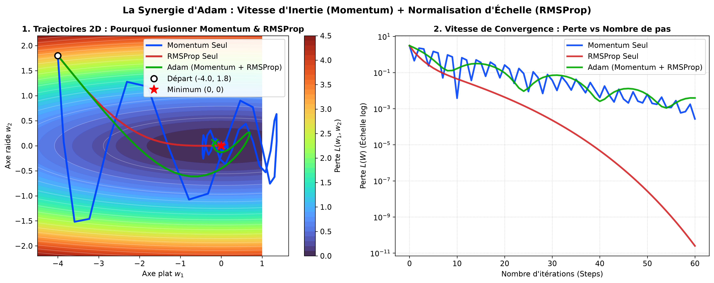
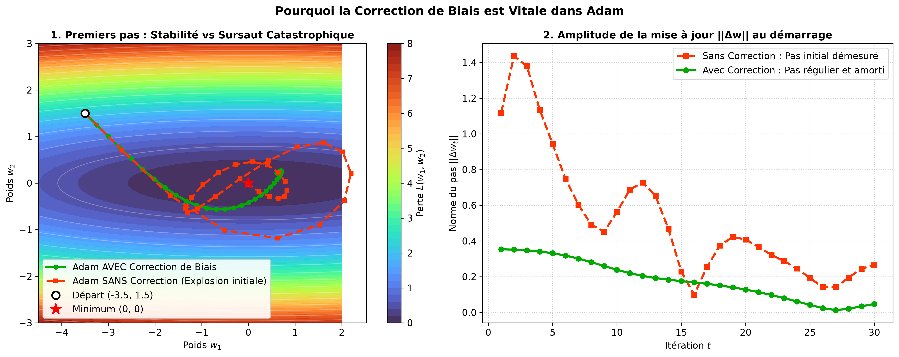

# 📓 Log 06 : Adam — Fusion de Momentum et RMSProp & Rôle de la Correction de Biais

- **Objectif** : Décortiquer l'optimiseur **Adam** (*Adaptive Moment Estimation*), comprendre la synergie entre le 1er moment (Momentum) et le 2nd moment (RMSProp), et visualiser le rôle protecteur indispensable de la **correction de biais**.
- **Référence Cours** : Stanford CS231n — Cours 3 (*Optimization & Adam*).

---

## 📊 Tableau Synthétique de la Famille des Moments

| Algorithme | Moment 1 ($m_t$ : Moyenne) | Moment 2 ($v_t$ : Variance) | Rôle & Bénéfice |
| :--- | :--- | :--- | :--- |
| **SGD + Momentum** | $m_t = \beta_1 m_{t-1} + (1-\beta_1) g_t$ | Aucun | Donne de l'inertie, traverse les zones plates et annule les oscillations |
| **RMSProp** | Aucun ($m_t = g_t$) | $v_t = \beta_2 v_{t-1} + (1-\beta_2) g_t^2$ | Normalise chaque axe individuellement (divise par $\sqrt{v_t}$) |
| **Adam** | $\hat{m}_t = \frac{m_t}{1 - \beta_1^t}$ | $\hat{v}_t = \frac{v_t}{1 - \beta_2^t}$ | **Combine les deux** : vitesse d'inertie + mise à l'échelle coordonnée par coordonnée |

### Code express (Formulation complète CS231n avec Correction de Biais) :
```python
# Hyperparamètres recommandés par Stanford CS231n
beta1 = 0.9
beta2 = 0.999
learning_rate = 1e-3  # Le classique "3e-4" d'Andrej Karpathy

# Boucle d'optimisation Adam
m = beta1 * m + (1.0 - beta1) * grad                  # 1er moment (Momentum)
v = beta2 * v + (1.0 - beta2) * (grad ** 2)           # 2nd moment (RMSProp)
m_hat = m / (1.0 - beta1 ** t)                        # Correction de biais 1
v_hat = v / (1.0 - beta2 ** t)                        # Correction de biais 2
w -= (learning_rate / (np.sqrt(v_hat) + 1e-8)) * m_hat # Mise à jour
```

---

## 🧭 1. La Synergie : Momentum seul vs RMSProp seul vs Adam



> **Observation** : Momentum seul (bleu) possède une forte inertie mais est déstabilisé par la forte pente verticale ($w_2$). RMSProp seul (rouge) compense parfaitement l'asymétrie mais avance lentement le long de l'axe plat ($w_1$). **Adam (vert)** combine les deux : il amortit immédiatement l'axe raide tout en accélérant sans hésitation le long de l'axe plat vers $(0, 0)$.

---

## 🛡️ 2. Le Rôle Vital de la Correction de Biais (*Bias Correction*)



> **Observation** : Initialisés à $v_0 = 0$, les premiers pas sans correction sous-estiment drastiquement la variance ($v_1 \approx 0.001 g^2$), provoquant une division par un nombre quasi-nul et un bond destructeur. La division par $(1 - \beta^t)$ normalise l'amplitude dès le pas 1 ($||\Delta w_1|| \approx \alpha$), garantissant un démarrage parfaitement stable.
