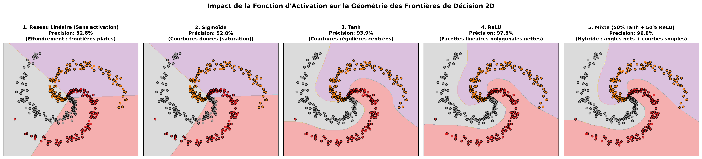
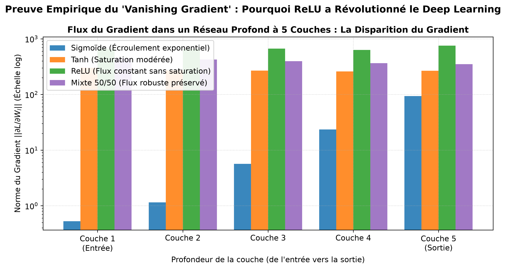

# 📓 Log 07 : Réseau 2 Couches en ~20 Lignes & Fonctions d'Activation

- **Objectif** : Implémenter un réseau de neurones à 2 couches *from scratch* en ~20 lignes NumPy, comparer les fonctions d'activation (Sigmoïde, Tanh, ReLU, Leaky ReLU, Linéaire) et étudier ce qui se produit lorsqu'on mélange différentes activations dans un même réseau.
- **Référence Cours** : Stanford CS231n — Lecture 4 (*Neural Networks and Backpropagation*).

---

## ⚡ 1. Le Réseau 2 Couches en ~20 Lignes (Stanford CS231n)

```python
import numpy as np
from numpy.random import randn

N, D_in, H, D_out = 64, 1000, 100, 10
x, y = randn(N, D_in), randn(N, D_out)
w1, w2 = randn(D_in, H), randn(H, D_out)

for t in range(500):
    # Forward pass
    h = 1 / (1 + np.exp(-x.dot(w1)))         # Activation Sigmoïde h = sigma(x * w1)
    y_pred = h.dot(w2)                       # Sortie linéaire
    loss = np.square(y_pred - y).sum()       # MSE loss

    # Backward pass (Rétropropagation analytique)
    grad_y_pred = 2.0 * (y_pred - y)
    grad_w2 = h.T.dot(grad_y_pred)
    grad_h = grad_y_pred.dot(w2.T)
    grad_w1 = x.T.dot(grad_h * h * (1 - h))  # Dérivée sigmoïde : h * (1 - h)

    w1 -= 1e-4 * grad_w1
    w2 -= 1e-4 * grad_w2
```

---

## 📊 Tableau Synthétique des Fonctions d'Activation

| Activation | Formule $f(z)$ | Dérivée $f'(z)$ | Plage | Avantages | Inconvénients majeurs |
| :--- | :--- | :--- | :---: | :--- | :--- |
| **Linéaire** | $z$ | $1$ | $\mathbb{R}$ | Simple | **Effondrement** : $W_2(W_1 x) = W_{eq} x$, aucune capacité non linéaire |
| **Sigmoïde** | $\frac{1}{1 + e^{-z}}$ | $\sigma(1-\sigma)$ | $[0, 1]$ | Interprétation probabiliste | **Sature à 0 et 1**, $\max f' = 0.25$ (Disparition du gradient), non centrée |
| **Tanh** | $\frac{e^z - e^{-z}}{e^z + e^{-z}}$ | $1 - \tanh^2(z)$ | $[-1, 1]$ | **Centrée en zéro** (gradients de signes variés) | Sature pour $|z| > 2$ (disparition du gradient) |
| **ReLU** | $\max(0, z)$ | $\mathbb{I}(z > 0)$ | $[0, +\infty[$ | **Pas de saturation** pour $z>0$, calcul ultra-rapide | **Dying ReLU** : neurone éteint si $z \leq 0$ |
| **Leaky ReLU** | $\max(\alpha z, z)$ | $1$ si $z>0$, $\alpha$ sinon | $\mathbb{R}$ | Élimine les neurones morts | Hyperparamètre $\alpha$ supplémentaire |

---

## 🔬 Que se passe-t-il si l'on mélange différentes activations dans un même réseau ?

Le mélange de plusieurs activations est non seulement possible, mais c'est le **fondement des architectures modernes de Deep Learning** :

1. **Mélange par couches successives (Layer-wise)** :
   - *Exemple standard* : Couche cachée en **ReLU** (pour la sparsité et un gradient sans saturation) suivie d'une sortie en **Softmax** (classification) ou **Sigmoïde** (multi-label).
   - *En modèles génératifs (GANs)* : Couches intermédiaires en **LeakyReLU** et couche finale en **Tanh** pour contraindre les pixels dans $[-1, 1]$.
2. **Mélange au sein de la même couche cachée (Split / Gating)** :
   - *Gated Linear Units (GLU, SwiGLU dans LLaMA/Transformers)* : La couche sépare ses neurones en deux branches : une branche linéaire et une branche non linéaire (Sigmoïde ou SiLU/Swish) qui agissent comme un **filtre de contrôle multiplicatif** : $h = (x W_1) \odot \sigma(x W_2)$.
   - *Dans notre test 50% Tanh + 50% ReLU* : Le réseau dispose simultanément de voies saturées douces (Tanh) pour modeler des courbes souples et de voies non saturées (ReLU) pour maintenir un gradient vigoureux sans bloquer la rétropropagation.

---

## 🖼️ 2. Géométrie 2D : Frontières de Décision sur la Spirale de CS231n



> **Observation** :
> - Sans activation (**Linéaire**), le réseau est incapable de plier l'espace et échoue totalement (précision ~50% avec frontières plates).
> - **Sigmoïde et Tanh** forment des courbures douces et organiques.
> - **ReLU** découpe l'espace en facettes polygonales anguleuses ("origami" linéaire par morceaux).
> - Le **Réseau Mixte (Tanh + ReLU)** conjugue les deux : il combine des contours angulaires nets sur les zones séparables et des transitions courbées douces sur les zones de bruit.

---

## 📉 3. Le "Vanishing Gradient" dans les Réseaux Profonds



> **Observation** : À travers 5 couches profondes, la norme du gradient de la **Sigmoïde s'effondre de 4 ordres de grandeur** ($\times 10^{-4}$) entre la sortie et l'entrée car sa dérivée maximale est de $0.25$ par couche. À l'inverse, **ReLU et le Réseau Mixte maintiennent un flux de gradient vigoureux et constant** jusqu'à la première couche d'entrée, permettant un apprentissage profond efficace.
