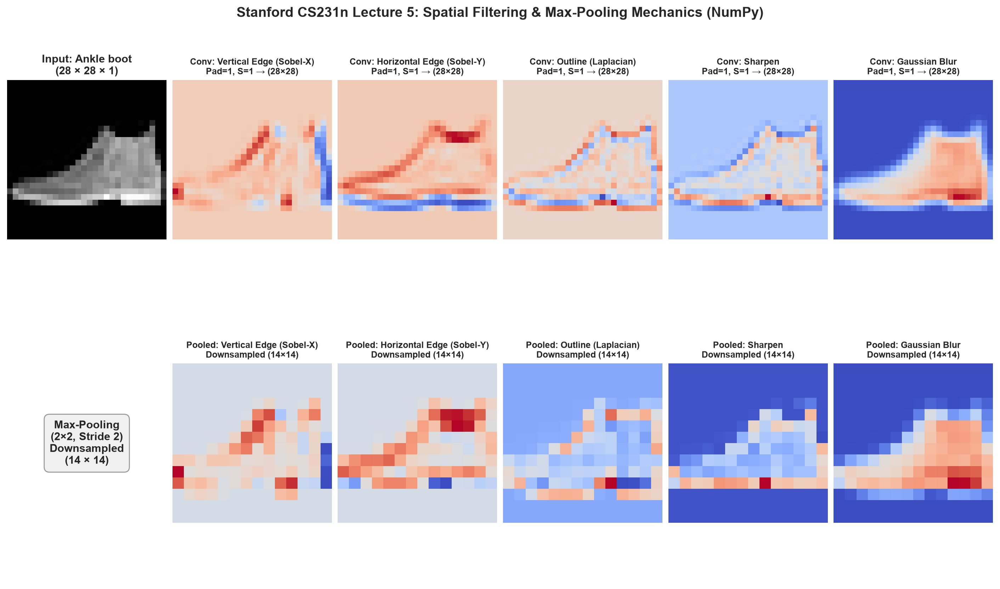
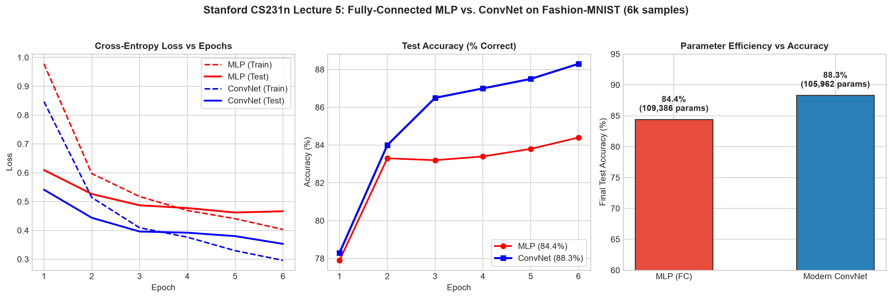
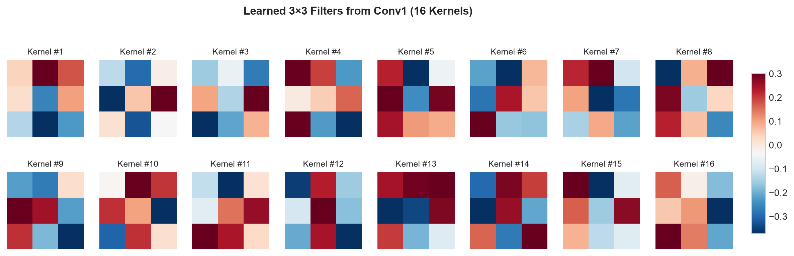
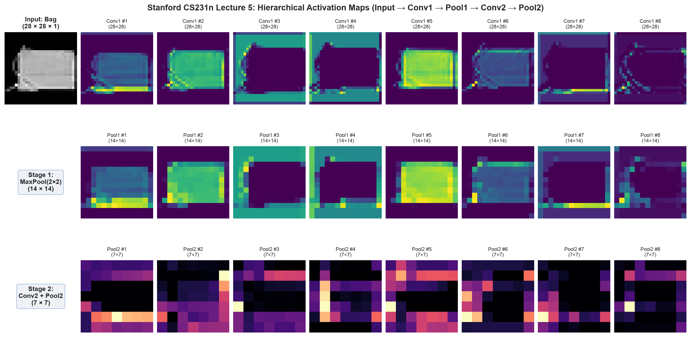

# Log 08 — Réseaux Convolutifs (CNN) : Arithmétique, Inductive Bias & Benchmark

Journal de bord d'expérimentation suivant la **Lecture 5 de Stanford CS231n** (*Convolutional Neural Networks*).  
Étude de la préservation de la topologie spatiale 2D, validation empirique de l'arithmétique des tenseurs et confrontation directe d'un ConvNet face à un MLP fully-connected.

---

## ⚡ Résumé Express des Résultats

| Modèle | Précision Test (6k) | Perte Test | Paramètres | Topologie Spatiale | Temps d'entraînement |
| :--- | :---: | :---: | :---: | :---: | :---: |
| **Fully-Connected MLP** | 84.40 % | 0.4666 | 109 386 | Détruite (vecteur aplati 784) | **2.1 s** |
| **Modern ConvNet (2 Conv + Pool)** | **88.30 %** | **0.3533** | 105 962 | **Préservée (volumes 3D)** | **7.7 s** |

> **Gain clé CS231n** : À nombre d'époques et de données identiques, le ConvNet surpasse le MLP de **+3.9 %** de précision et réduit la perte de **24 %**, démontrant la puissance du *biais inductif spatial* (partage de poids et connectivité locale).

---

## 1. Arithmétique de la Convolution (Formule Stanford)

La dimension de sortie spatiale d'une couche convolutive est régie par la formule clé du cours :

$$\text{Output Size} = \left\lfloor\frac{W - F + 2P}{S}\right\rfloor + 1$$

- $W$ : taille spatiale d'entrée (largeur/hauteur).
- $F$ : taille spatiale du filtre (kernel size, ex: $3 \times 3$).
- $P$ : zéro-padding ajouté sur les bords.
- $S$ : pas de balayage (*stride*).

### Règles d'or CS231n :
1. **Padding "Same"** : Pour conserver exactement la résolution ($W_{out} = W_{in}$) avec $S=1$, on fixe $P = \frac{F - 1}{2}$ (ex: $P=1$ pour $F=3$, $P=2$ pour $F=5$).
2. **Nombre de paramètres par couche Conv** :
   $$\text{Params} = (F \times F \times C_{in} + 1) \times C_{out}$$
   *(Indépendant de la résolution spatiale $W \times H$ de l'image, contrairement aux couches Fully-Connected !)*



---

## 2. Benchmark Empirique : ConvNet vs MLP (Fashion-MNIST)

Entraînement comparatif mené en local sur un sous-ensemble de 6 000 images avec optimiseur Adam ($\text{lr} = 10^{-3}$) :

- **MLP** : `Flatten(784) -> Linear(128) -> ReLU -> Dropout -> Linear(64) -> ReLU -> Linear(10)`.
- **ConvNet** : `Conv2D(16, 3x3) -> BN -> ReLU -> MaxPool(2) -> Conv2D(32, 3x3) -> BN -> ReLU -> MaxPool(2) -> FC(64) -> FC(10)`.



### Observations :
1. **Convergence accélérée** : Dès la 2ᵉ époque, le ConvNet atteint 84.0 %, niveau que le MLP peine à dépasser en fin d'entraînement.
2. **Régularisation structurelle** : Le MLP commence à sur-apprendre (écart train/test loss qui stagne), tandis que le ConvNet continue de descendre régulièrement ($0.35$ vs $0.47$).

---

## 3. Ce que le Réseau Apprend Réellement

### A. Filtres de Première Couche (Conv1 - 16 Kernels 3×3)
Le modèle apprend automatiquement des détecteurs d'orientations (lignes diagonales, gradients horizontaux/verticaux et contrastes centre-pourtour), analogue aux cellules simples du cortex visuel découvertes par Hubel & Wiesel.



### B. Cartes d'Activation Hiérarchiques (Feature Maps)
En faisant passer une image de test dans le réseau :
- **Conv1 (28×28)** : Détection des contours nets de la chaussure / botte.
- **MaxPool1 (14×14)** : Réduction spatiale par 2 tout en conservant les activations maximales (invariance aux légères translations).
- **Conv2 + MaxPool2 (7×7)** : Combinaisons de motifs plus abstraits et compacts avant la décision finale.



---

## 4. Implémentation NumPy Pure (Forward Pass)

Extrait synthétique du code développé dans [`conv_mechanics.py`](./conv_mechanics.py) :

```python
def conv2d_forward_numpy(x, w, b, stride=1, pad=0):
    N, C_in, H_in, W_in = x.shape
    C_out, _, KH, KW = w.shape
    H_out = int((H_in - KH + 2 * pad) / stride) + 1
    W_out = int((W_in - KW + 2 * pad) / stride) + 1
    
    x_padded = np.pad(x, ((0,0), (0,0), (pad,pad), (pad,pad)), mode="constant")
    out = np.zeros((N, C_out, H_out, W_out), dtype=x.dtype)
    
    for n in range(N):
        for c in range(C_out):
            for i in range(H_out):
                for j in range(W_out):
                    window = x_padded[n, :, i*stride:i*stride+KH, j*stride:j*stride+KW]
                    out[n, c, i, j] = np.sum(window * w[c]) + b[c]
    return out
```

---

## 5. Scripts du Dépôt

- [`conv_mechanics.py`](./conv_mechanics.py) : Implémentation *from scratch* en pur NumPy de la convolution 2D et du max-pooling, test de filtres classiques (Sobel, Laplacian, Gaussian blur) et tracé de la figure 1.
- [`train_cnn_benchmark.py`](./train_cnn_benchmark.py) : Entraînement PyTorch local comparatif (MLP vs ConvNet), extraction des poids des filtres et visualisation des cartes d'activation couche par couche.
