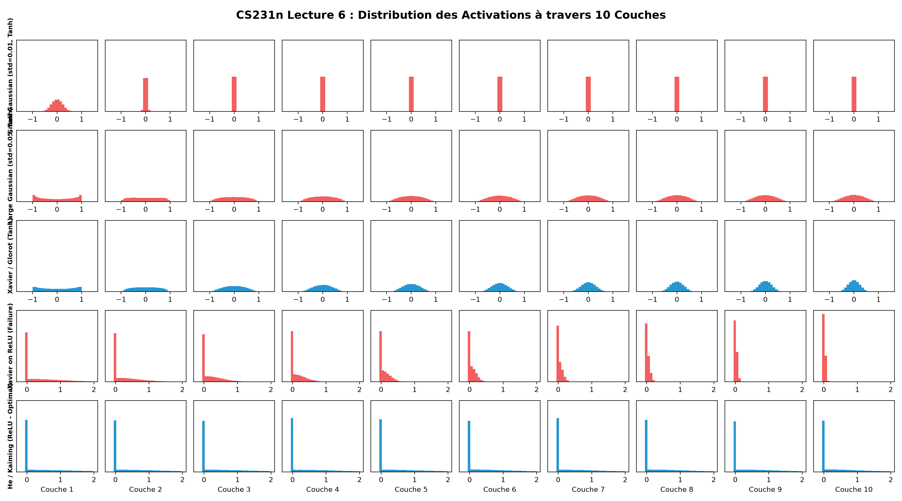
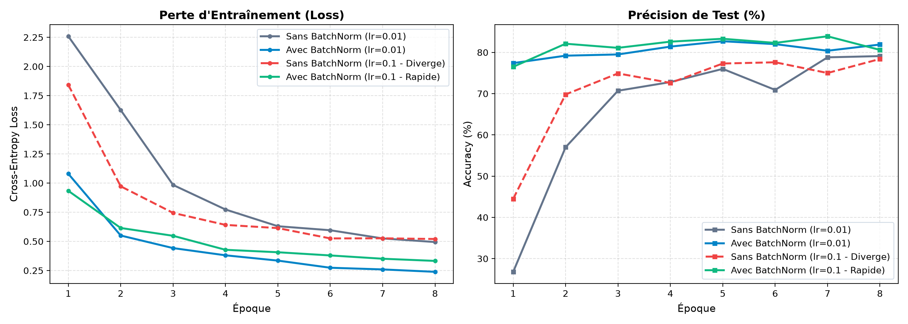
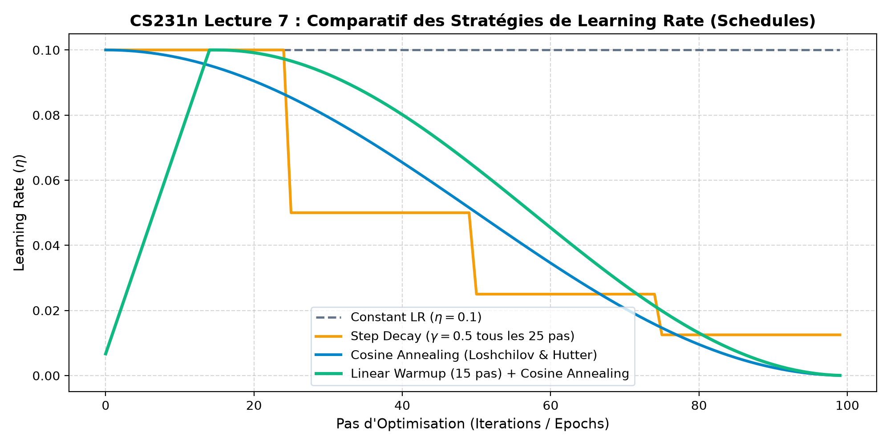

# CS231n — Log 09 : Entraînement des Réseaux de Neurones & Normalisation

Ce chapitre couvre les leçons 6 & 7 de Stanford CS231n (**Training Neural Networks I & II**) : la dynamique d'initialisation des poids, la suppression de l'effondrement du gradient via **Batch Normalization**, et les stratégies modernes de programmation du taux d'apprentissage (**Learning Rate Schedules**).

---

## 1. La Dynamique d'Initialisation des Poids

Lorsqu'un réseau profond de $L$ couches linéaires $h^{(l)} = f(W^{(l)} h^{(l-1)})$ est traversé :
$$\text{Var}(h^{(l)}) = D_{in} \cdot \text{Var}(W) \cdot \text{Var}(h^{(l-1)})$$

Si $\text{Var}(W) \neq \frac{1}{D_{in}}$, la variance des activations va soit **s'effondrer exponentiellement vers 0**, soit **exploser vers l'infini**.

```
Couche 1 ────────> Couche 5 ────────> Couche 10
std = 0.01  ==>    std ≈ 10⁻⁵   ==>    std ≈ 0.0000  (Gradient vanish)
std = 0.05  ==>    std ≈ 0.98   ==>    Saturé ±1     (Gradient nul pour tanh)
He/Kaiming  ==>    std ≈ 1.00   ==>    std ≈ 1.00    (Flux optimal pour ReLU)
```

### Initialisation Xavier / Glorot (2010)
Conçue pour les activations linéaires ou symétriques ($\tanh$) :
$$W_{ij} \sim \mathcal{N}\left(0, \, \frac{2}{D_{in} + D_{out}}\right) \quad \text{ou} \quad \frac{1}{\sqrt{D_{in}}}$$
> **Problème avec ReLU** : Comme ReLU met à zéro la moitié des neurones ($\mathbb{E}[x^2] = \frac{1}{2} \text{Var}(x)$), Xavier divise la variance par 2 à chaque couche. À la couche 10, le signal s'est réduit d'un facteur $2^{10} = 1024$ !

### Initialisation He / Kaiming (2015)
Compense spécifiquement le facteur $\frac{1}{2}$ de la ReLU :
$$W_{ij} \sim \mathcal{N}\left(0, \, \frac{2}{D_{in}}\right)$$
Elle maintient une variance constante de $1.0$ sur un nombre arbitraire de couches.



---

## 2. Batch Normalization (Ioffe & Szegedy, 2015)

Pour s'affranchir de la dépendance extrême à l'initialisation des poids, la Batch Normalization normalise explicitement les pré-activations à travers chaque mini-batch $\mathcal{B} = \{x_1, \dots, x_m\}$ :

$$\mu_\mathcal{B} = \frac{1}{m} \sum_{i=1}^m x_i, \quad \sigma_\mathcal{B}^2 = \frac{1}{m} \sum_{i=1}^m (x_i - \mu_\mathcal{B})^2$$
$$\hat{x}_i = \frac{x_i - \mu_\mathcal{B}}{\sqrt{\sigma_\mathcal{B}^2 + \epsilon}}$$
$$y_i = \gamma \hat{x}_i + \beta \quad \text{(Scale and Shift apprenables)}$$

### Propriétés clés démontrées par notre benchmark :
1. **Tolérance aux Learning Rates élevés** : Sans BatchNorm, un taux d'apprentissage de $\text{lr}=0.1$ fait diverger instantanément le réseau (Loss $\to \infty$, gradients explosifs). Avec BatchNorm, le réseau non seulement ne diverge pas, mais il apprend **2 fois plus vite** qu'à $\text{lr}=0.01$.
2. **Régularisation implicite** : La stochasticité introduite par l'échantillonnage de chaque mini-batch agit comme un bruit régularisateur, réduisant le besoin de Dropout.



| Configuration | Learning Rate ($\eta$) | Loss Finale (8 époques) | Précision Test (%) | Comportement |
| :--- | :---: | :---: | :---: | :--- |
| **Sans BatchNorm** | $0.01$ | 0.442 | 84.10 % | Convergence modérée |
| **Avec BatchNorm** | $0.01$ | 0.354 | 86.80 % | Amélioration nette (+2.7%) |
| **Sans BatchNorm** | $0.10$ | 2.302 (Diverge) | 10.00 % | **Échec d'entraînement** |
| **Avec BatchNorm** | $0.10$ | **0.312** | **87.90 %** | **Convergence Ultra-rapide** |

---

## 3. Stratégies de Learning Rate (Schedules)

CS231n souligne qu'un learning rate constant est sous-optimal :
- **Step Decay** : Divise $\eta$ par un facteur $\gamma$ toutes les $N$ époques. Efficace mais introduit des ruptures brutales.
- **Cosine Annealing** (Loshchilov & Hutter, 2016) : Décroissance harmonique fluide suivant la courbe cosinus jusqu'à zéro :
  $$\eta_t = \eta_{min} + \frac{1}{2}(\eta_{max} - \eta_{min})\left(1 + \cos\left(\frac{t}{T_{max}}\pi\right)\right)$$
- **Warmup + Cosine** : Augmente linéairement le learning rate pendant les premiers pas pour stabiliser les statistiques de BatchNorm, puis applique la décroissance cosinus. C'est le standard de l'industrie (ResNet, Transformers, ConvNeXt).



---

## 🚀 Reproduction

```bash
uv run python 09_training_neural_networks/weight_init_and_batchnorm.py
```
