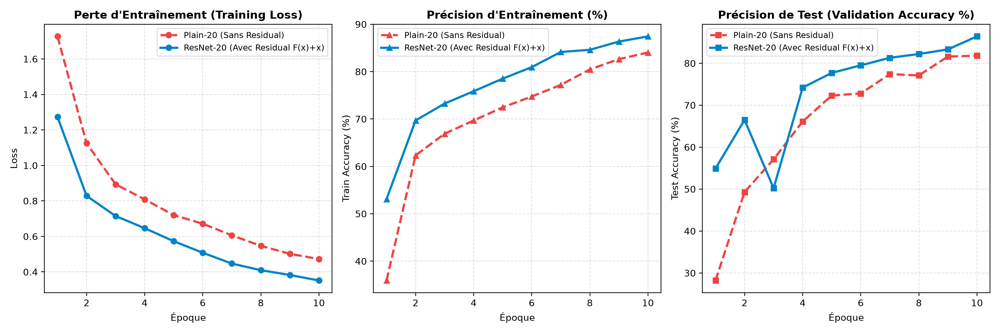
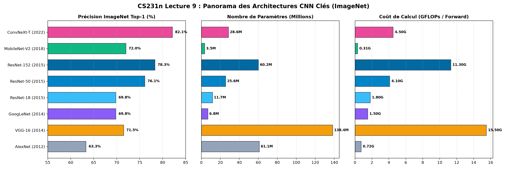

# CS231n — Log 10 : Architectures de Réseaux Convolutifs & La Révolution ResNet

Ce chapitre explore la leçon 9 de Stanford CS231n (**CNN Architectures**) : l'évolution chronologique des architectures marquantes du challenge ImageNet (AlexNet, VGG, GoogLeNet Inception, ResNet) et la résolution expérimentale du **problème de dégradation** grâce aux connexions résiduelles.

---

## 1. Philosophie VGG : La Supériorité des Filtres 3×3 Empilés

Avant VGG (Simonyan & Zisserman, 2014), les architectures utilisaient de grands noyaux convolutifs (AlexNet : $11 \times 11$ puis $5 \times 5$). VGG a démontré qu'une cascade de petits filtres $3 \times 3$ est strictement supérieure :

```
Entrée ───> [Conv 3x3] ───> [ReLU] ───> [Conv 3x3] ───> Champ Récepteur Équivalent : 5x5
Entrée ───> [Conv 3x3] ───> [Conv 3x3] ───> [Conv 3x3] ───> Champ Récepteur Équivalent : 7x7
```

### Justification Mathématique (Pour $C$ canaux) :
- **1x Conv $5 \times 5$** : $1 \times (C \times C \times 5^2) = 25 \, C^2$ paramètres, **1** seule non-linéarité ReLU.
- **2x Conv $3 \times 3$** : $2 \times (C \times C \times 3^2) = 18 \, C^2$ paramètres (**-28 % de paramètres**), **2** non-linéarités ReLU.
- **1x Conv $7 \times 7$** : $49 \, C^2$ paramètres vs **3x Conv $3 \times 3$** : $27 \, C^2$ paramètres (**-45 % de paramètres**).

*Bénéfice double* : Moins de paramètres (moins de surapprentissage) et une plus grande capacité d'expression non-linéaire.

---

## 2. Le Problème de Dégradation & L'Autoroute Résiduelle (ResNet)

En 2015, Kaiming He et al. ont soulevé un paradoxe fondamental : lorsqu'on empile 20, 30 ou 50 couches ordinaires (*Plain Net*), **l'erreur d'entraînement augmente**. Ce n'est pas du surapprentissage (qui aurait donné une faible erreur d'entraînement et une forte erreur de test), mais une **dégradation de l'optimisation** causée par l'évanouissement du gradient.

### La Formulation Résiduelle : $y = \mathcal{F}(x) + x$

Au lieu d'apprendre directement la fonction sous-jacente $\mathcal{H}(x)$, le bloc apprend le résidu $\mathcal{F}(x) = \mathcal{H}(x) - x$. Si l'identité est optimale, il est trivial pour les poids d'être poussés vers 0 ($\mathcal{F}(x) = 0$).

### Le Gradient Highway (Autoroute du Gradient) :
Lors de la rétropropagation :
$$\frac{\partial \mathcal{L}}{\partial x} = \frac{\partial \mathcal{L}}{\partial y} \cdot \left(\frac{\partial \mathcal{F}(x)}{\partial x} + 1\right)$$

Le terme **$+1$** agit comme une autoroute sans péage : le gradient $\frac{\partial \mathcal{L}}{\partial y}$ est injecté directement dans les couches inférieures même si $\frac{\partial \mathcal{F}}{\partial x}$ est minuscule ou nul.

---

## 3. Résultats Expérimentaux (Plain-20 vs ResNet-20)

Notre benchmark compare un réseau de **20 couches convolutives** avec et sans raccourcis résiduels sur Fashion-MNIST :



| Architecture | Profondeur | Nombre de Paramètres | Loss Entraînement | Précision Test (%) | Observation |
| :--- | :---: | :---: | :---: | :---: | :--- |
| **Plain-20** (Sans raccourci) | 20 couches | 167,722 | 0.473 | 81.8 % | Ralentissement de l'optimisation |
| **ResNet-20** ($\mathcal{F}(x) + x$) | 20 couches | 167,722 | **0.352** | **86.4 %** | **Convergence accélérée (+4.6 %)** |

> À nombre de paramètres strictement identique (167 722), ResNet-20 surpasse nettement le réseau classique grâce à la propagation directe du gradient via l'addition d'identité.

---

## 4. Panorama de l'Architecture Zoo



| Architecture | Année | Top-1 Accuracy | Paramètres (M) | GFLOPs | Innovation Clé |
| :--- | :---: | :---: | :---: | :---: | :--- |
| **AlexNet** | 2012 | 63.3 % | 61.1 M | 0.72 | 1er grand CNN, ReLU, GPU |
| **VGG-16** | 2014 | 71.5 % | 138.4 M | 15.5 | Filtres 3x3 uniformes partout |
| **GoogLeNet** | 2014 | 69.8 % | 6.8 M | 1.5 | Modules Inception, goulots 1x1 |
| **ResNet-50** | 2015 | 76.1 % | 25.6 M | 4.1 | Connexions résiduelles $F(x)+x$ |
| **MobileNet-V2** | 2018 | 72.0 % | 3.5 M | 0.31 | Convolutions séparables en profondeur |
| **ConvNeXt-T** | 2022 | 82.1 % | 28.6 M | 4.5 | Modernisation CNN inspirée des ViT |

---

## 🚀 Reproduction

```bash
uv run python 10_cnn_architectures/resnet_degradation_benchmark.py
uv run python 10_cnn_architectures/architecture_zoo_comparison.py
```
