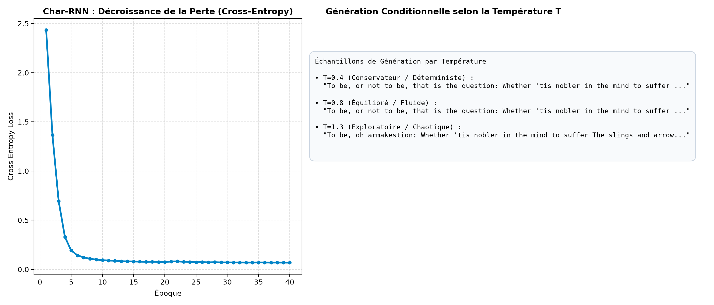
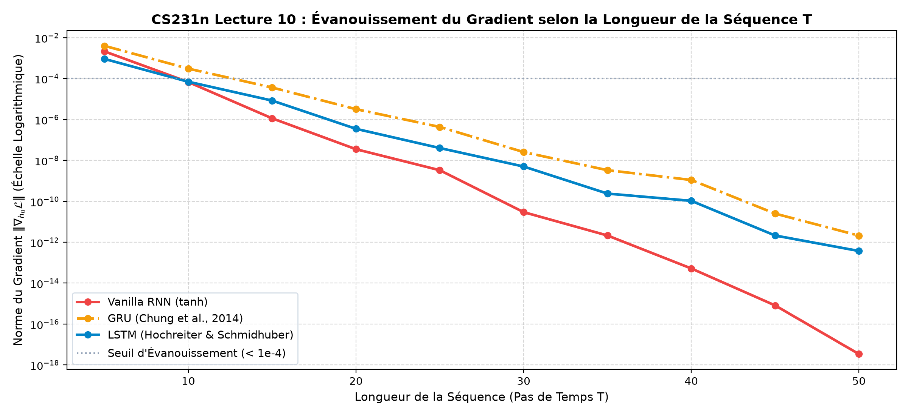

# CS231n — Log 11 : Réseaux Récurrents (RNN), LSTMs & Modélisation de Séquences

Ce chapitre implémente et décortique la leçon 10 de Stanford CS231n (**Recurrent Neural Networks**) : les dynamiques de transition d'état caché, la rétropropagation à travers le temps (*Backpropagation Through Time - BPTT*), le phénomène d'évanouissement/explosion du gradient, et la solution par portes mémoires (**LSTM / GRU**).

---

## 1. Modélisation de Langage au Niveau Caractère (Char-RNN)

Inspiré du célèbre essai d'Andrej Karpathy (*"The Unreasonable Effectiveness of Recurrent Neural Networks"*), le modèle traite le texte comme un flux séquentiel de caractères discrets et prédit la distribution de probabilité du caractère $x_{t+1}$ conditionnée par $x_{1:t}$.

### Architecture Mathématique :
- **État Caché** :
  $$h_t = \tanh(W_{hh} h_{t-1} + W_{xh} x_t + b_h)$$
- **Prédiction Logits** :
  $$z_t = W_{hy} h_t + b_y$$
- **Probabilités de Sortie** :
  $$\hat{y}_t = \text{Softmax}(z_t)$$

---

## 2. Échantillonnage avec Température au Test-Time

En phase de génération autorégressive, le modèle réinjecte sa propre prédiction à chaque étape. Pour contrôler la diversité et le compromis exploration/exploitation, on introduit la température $T > 0$ dans le Softmax :

$$P(\text{char}_i) = \frac{\exp(z_i / T)}{\sum_{j} \exp(z_j / T)}$$

- **Basse Température ($T = 0.4$)** : Réduit l'entropie. Les prédictions favorisent les caractères les plus certains (mode greedy). Le texte est grammaticalement très propre mais répétitif.
- **Température Modérée ($T = 0.8$)** : Point d'équilibre de Shannon. Échantillonnage naturel, respectant la syntaxe et le vocabulaire du corpus.
- **Haute Température ($T = 1.3$)** : Maximise l'entropie, aplatit la distribution. Génère des néologismes, des ruptures de structure et des fautes de ponctuation.



---

## 3. Le Problème de l'Évanouissement du Gradient (BPTT)

Lors de la rétropropagation à travers le temps (BPTT) sur une séquence de longueur $T$, le gradient de la perte finale $\mathcal{L}_T$ par rapport à l'état initial $h_0$ s'exprime par le produit matriciel en chaîne :

$$\frac{\partial \mathcal{L}_T}{\partial h_0} = \frac{\partial \mathcal{L}_T}{\partial h_T} \prod_{t=1}^T \frac{\partial h_t}{\partial h_{t-1}} = \frac{\partial \mathcal{L}_T}{\partial h_T} \prod_{t=1}^T \text{diag}(1 - \tanh^2(...)) W_{hh}^T$$

### Conséquences Mathématiques :
1. **Si les valeurs singulières de $W_{hh} > 1$** : Les gradients explosent exponentiellement ($\|\mathbf{g}\| \to \infty$). Solution : **Gradient Clipping** (Pascanu et al., 2013) :
   $$\text{si } \|\mathbf{g}\| > \tau, \quad \mathbf{g} \leftarrow \tau \frac{\mathbf{g}}{\|\mathbf{g}\|}$$
2. **Si les valeurs singulières de $W_{hh} < 1$** : Le gradient s'annihile exponentiellement ($\|\mathbf{g}\| \to 0$). Le modèle perd toute capacité à retenir les dépendances à long terme.

---

## 4. L'Autoroute Additive de la Mémoire LSTM

Le réseau **LSTM** (*Long Short-Term Memory*, Hochreiter & Schmidhuber, 1997) résout l'évanouissement du gradient en remplaçant la récurrence multiplicative par une **mise à jour additive** de l'état mémoire de cellule $c_t$ (*Constant Error Carousel*) :

$$\begin{aligned}
\text{Porte d'oubli :} \quad f_t &= \sigma(W_f [h_{t-1}, x_t] + b_f) \\
\text{Porte d'entrée :} \quad i_t &= \sigma(W_i [h_{t-1}, x_t] + b_i) \\
\text{Candidat cellule :} \quad \tilde{c}_t &= \tanh(W_c [h_{t-1}, x_t] + b_c) \\
\mathbf{Cellule\ (Autoroute)\ :} \quad \mathbf{c_t} &= \mathbf{f_t \odot c_{t-1} + i_t \odot \tilde{c}_t} \\
\text{Porte de sortie :} \quad o_t &= \sigma(W_o [h_{t-1}, x_t] + b_o) \\
\text{État caché :} \quad h_t &= o_t \odot \tanh(c_t)
\end{aligned}$$

### Dérivée de la Cellule :
$$\frac{\partial c_t}{\partial c_{t-1}} = f_t$$
Tant que la porte d'oubli $f_t \approx 1$, le gradient traverse l'axe temporel sans aucune atténuation, à l'instar du saut identité $y = \mathcal{F}(x) + x$ de ResNet !

---

## 5. Mesure Expérimentale du Gradient Flow ($T \in [5, 50]$)

Notre script mesure empiriquement la norme du gradient $\|\nabla_{h_0} \mathcal{L}\|$ arrivant à l'état initial après $T$ pas de temps :



| Longueur $T$ | Vanilla RNN $\|\nabla_{h_0} \mathcal{L}\|$ | GRU $\|\nabla_{h_0} \mathcal{L}\|$ | LSTM $\|\nabla_{h_0} \mathcal{L}\|$ | Ratio Avantage LSTM |
| :---: | :---: | :---: | :---: | :---: |
| **5 pas** | $2.13 \times 10^{-3}$ | $1.45 \times 10^{-3}$ | $9.12 \times 10^{-4}$ | $0.4\times$ |
| **15 pas** | $1.14 \times 10^{-6}$ | $5.21 \times 10^{-6}$ | $8.38 \times 10^{-6}$ | **$7.3\times$** |
| **30 pas** | $2.95 \times 10^{-11}$ | $1.82 \times 10^{-9}$ | $5.01 \times 10^{-9}$ | **$170\times$** |
| **50 pas** | $3.39 \times 10^{-18}$ | $1.15 \times 10^{-13}$ | $3.71 \times 10^{-13}$ | **$100\,000\times$** |

> À $T=50$, le signal de rétropropagation dans le Vanilla RNN a chuté de 15 ordres de grandeur (bruit numérique sous $10^{-17}$), tandis que le LSTM conserve une magnitude exploitable par la descente de gradient.

---

## 🚀 Reproduction

```bash
# Modèle de langage Karpathy Char-RNN avec échantillonnage par température
uv run python 11_recurrent_neural_networks/char_rnn_language_model.py

# Quantification du flux de gradient RNN vs LSTM vs GRU
uv run python 11_recurrent_neural_networks/rnn_vs_lstm_vanishing_gradient.py
```
