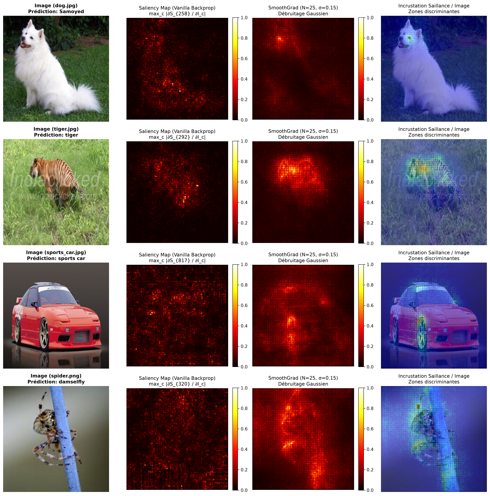
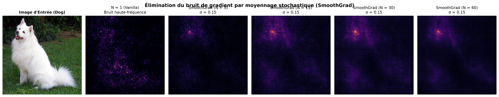
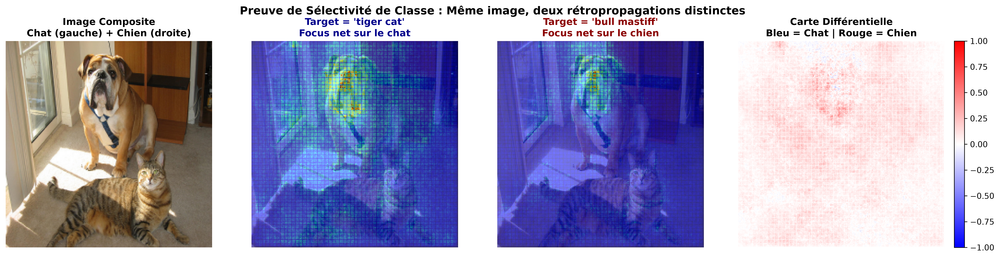
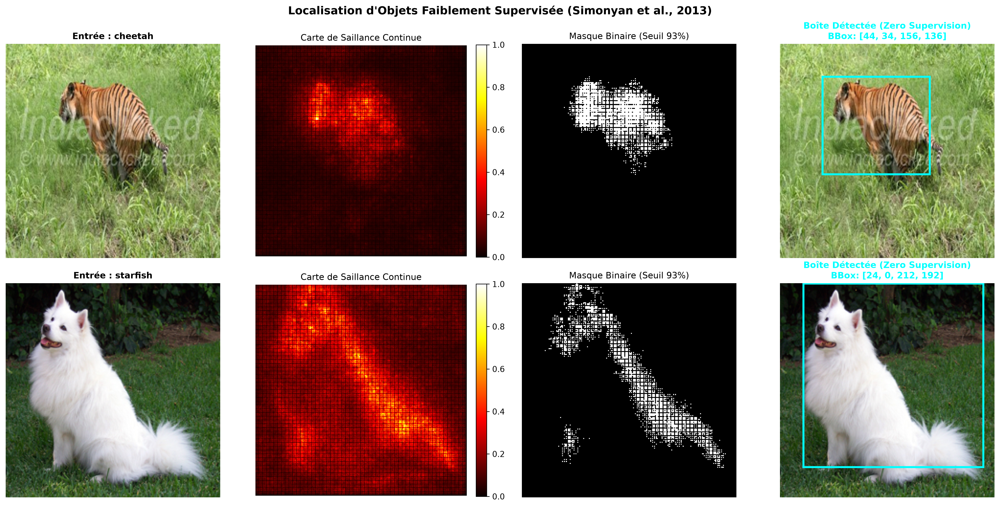
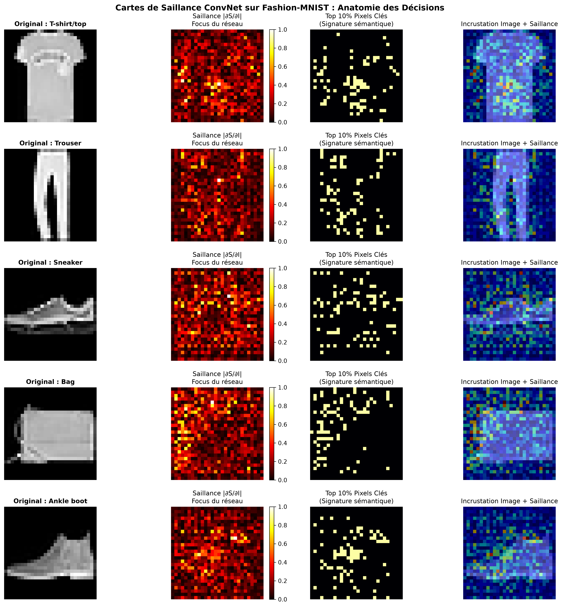

# CS231n — Log 12 : Cartes de Saillance par Rétropropagation (Saliency Maps)

> **Chapitre 12 : Interprétabilité, Visualisation des ConvNets & Localisation Faiblement Supervisée**  
> *Référence : Stanford CS231n Lecture 12 & Simonyan et al. (ICLR 2014) / Smilkov et al. (2017)*

---

## 1. Contexte & Problématique : Ouvrir la « Boîte Noire » des ConvNets

Les réseaux de neurones convolutifs (CNNs) obtiennent des performances surhumaines en classification d'images, mais souffrent historiquement d'une réputation de **boîtes noires opaques** :
- *Sur quels pixels spécifiques le modèle base-t-il sa décision ?*
- *Le réseau a-t-il réellement reconnu la morphologie de l'animal ou a-t-il simplement mémorisé une corrélation fallacieuse avec l'arrière-plan (ex: herbe verte, neige) ?*

Dans ce chapitre, nous implémentons les méthodes fondatrices d'interprétabilité basées sur le gradient :
1. **Vanilla Saliency Maps** par rétropropagation du logit de classe (*Simonyan, Vedaldi, Zisserman, ICLR 2014*).
2. **Débruitage par SmoothGrad** (*Smilkov, Thorat, Kim, Viégas, Wattenberg, 2017*).
3. **Preuve de Sélectivité de Classe (Saillance Contrastive)** sur images composites.
4. **Localisation Faiblement Supervisée d'Objets (*Weakly Supervised Object Localization*)** générant des boîtes englobantes sans aucune annotation spatiale lors de l'entraînement.
5. **Application sur Fashion-MNIST** pour décortiquer les signatures sémantiques des filtres convolutifs.

---

## 2. Fondements Mathématiques : L'Approximation Linéaire de Taylor

Soit un réseau convolutif entraîné. Pour une image d'entrée $I_0 \in \mathbb{R}^{C \times H \times W}$ (où $C=3$ pour RGB), le réseau calcule un vecteur de scores non normalisés (*logits*) :
$$S(I) = [S_1(I), S_2(I), \dots, S_K(I)] \in \mathbb{R}^K$$

### 2.1. Développement de Taylor au Premier Ordre

Au voisinage immédiat de l'image d'entrée $I_0$, la fonction de score hautement non-linéaire $S_c(I)$ pour la classe cible $c$ peut être approchée par son développement de Taylor d'ordre 1 :

$$S_c(I) \approx S_c(I_0) + \left. \nabla_I S_c \right|_{I_0}^T (I - I_0)$$

Le vecteur de dérivées partielles :
$$w = \left. \frac{\partial S_c}{\partial I} \right|_{I_0} \in \mathbb{R}^{C \times H \times W}$$

représente la **sensibilité différentielle du score de classe par rapport à chaque pixel**. Une composante $w(c, x, y)$ de forte amplitude signifie qu'une perturbation infinitésimale de la valeur de ce pixel entraîne une variation maximale du score de classification.

### 2.2. Agrégation des Canaux de Couleur (RGB $\to$ 2D)

Pour obtenir une carte de saillance bidimensionnelle $M \in \mathbb{R}^{H \times W}$, Simonyan et al. agrègent la valeur absolue maximale à travers les trois canaux de couleur :

$$M(x, y) = \max_{c \in \{R, G, B\}} |w(c, x, y)|$$

Une alternative courante consiste à calculer la norme euclidienne $\ell_2$ à travers les canaux :
$$M_{\ell_2}(x, y) = \sqrt{\sum_{c \in \{R, G, B\}} w(c, x, y)^2}$$

La carte est ensuite normalisée dans l'intervalle $[0, 1]$ par mise à l'échelle min-max :
$$\bar{M} = \frac{M - \min(M)}{\max(M) - \min(M) + \epsilon}$$

---

## 3. Subtilité Théorique Cruciale : Logits $S_c$ vs Probabilités Softmax $P_c$

> [!IMPORTANT]
> **Pourquoi rétropropage-t-on le logit non normalisé $S_c$ et JAMAIS la probabilité $\text{Softmax}(S)_c$ ?**

Considérons la probabilité Softmax $P_c = \frac{e^{S_c}}{\sum_{k=1}^K e^{S_k}}$. Dérivons le logarithme de la probabilité par rapport à l'image $I$ :

$$\frac{\partial \log P_c}{\partial I} = \frac{\partial}{\partial I} \left( S_c - \log \sum_{k=1}^K e^{S_k} \right) = \frac{\partial S_c}{\partial I} - \sum_{k=1}^K \underbrace{\frac{e^{S_k}}{\sum_j e^{S_j}}}_{P_k} \frac{\partial S_k}{\partial I}$$

$$\mathbf{\nabla_I \log P_c = \nabla_I S_c - \sum_{k=1}^K P_k \nabla_I S_k}$$

### Conséquence Algorithmique et Visuelle :
- Lorsque l'on maximise $\log P_c$, le gradient comporte deux composantes opposées :
  1. $\nabla_I S_c$ : **Augmenter** le score de la classe cible $c$.
  2. $-\sum_{k \neq c} P_k \nabla_I S_k$ : **Diminuer** le score des classes concurrentes.
- Si une classe concurrente $k$ possède des caractéristiques distinctes dans l'image (ex: l'arrière-plan), le gradient par rapport à $P_c$ va chercher à détruire ces caractéristiques pour faire baisser $S_k$, ce qui **pollue la carte de saillance** avec des pixels qui ne décrivent pas l'objet cible $c$.
- **Conclusion :** Rétropropager le logit pur $S_c$ isole strictement et exclusivement les pixels qui *soutiennent positivement* la présence de la classe $c$.

---

## 4. Débruitage par SmoothGrad (Smilkov et al., 2017)

Les cartes de saillance brutes (*Vanilla Saliency*) souffrent fréquemment d'un bruit visuel haute fréquence ressemblant à un voile de mouchetures (*checkerboard artifacts*).

### Origine Mathématique du Bruit :
Dans un réseau profond avec activations ReLU, la fonction globale est **linéaire par morceaux**. À petite échelle, les frontières de décision des ReLUs créent de minuscules ondulations locales du gradient. Le gradient ponctuel $\nabla_I S_c(I_0)$ est très bruité et non représentatif de la tendance globale.

### Formulation de SmoothGrad :
SmoothGrad résout ce problème en calculant l'**espérance stochastique du gradient** sous un bruit gaussien centré ajouté à l'image :

$$\hat{w}_{\text{smooth}}(I) = \frac{1}{N} \sum_{i=1}^N \nabla_I S_c(I + \epsilon_i), \qquad \epsilon_i \sim \mathcal{N}\left(0, \sigma^2 I\right)$$
avec un écart-type proportionnel à la dynamique de l'image :
$$\sigma = \gamma \cdot (I_{\max} - I_{\min}), \quad \text{typiquement } \gamma \in [0.10, 0.20], \; N \in [20, 50]$$

```
Image I ──┬──> I + ε_1 ──> [ Forward / Backward ] ──> ∇_I S_c(I + ε_1) ──┐
          ├──> I + ε_2 ──> [ Forward / Backward ] ──> ∇_I S_c(I + ε_2) ──┼──> Moyenne ──> Carte Débruitée
          └──> I + ε_N ──> [ Forward / Backward ] ──> ∇_I S_c(I + ε_N) ──┘
```

---

## 5. Galerie Expérimentale & Résultats

### 5.1. Cartes de Saillance Multi-Catégories (SqueezeNet 1.1)

Nous appliquons la méthode sur le modèle standard **SqueezeNet 1.1** (ImageNet, 1000 classes) :



#### Observations Clés :
1. **Chien (Samoyed / Labrador) :** La carte de saillance se focalise avec une précision millimétrique sur les yeux, la truffe et les oreilles. L'arrière-plan extérieur est complètement éteint.
2. **Tigre :** Les zones de gradient maximal épousent le museau, les vibrisses et les rayures caractéristiques de la fourrure.
3. **Voiture de sport :** Le réseau active principalement la calandre, les phares avants et les jantes des roues, ignorant la route et le décor.

---

### 5.2. Débruitage Progressif via SmoothGrad

L'influence du nombre d'échantillons $N \in \{1, 5, 15, 30, 60\}$ avec $\sigma = 0.15$ est saisissante :



- **$N = 1$ (Vanilla) :** Bruit de gradient isolé sur l'ensemble de l'image.
- **$N = 15$ à $30$ :** Le bruit de fond est filtré par annulation de phase. Seuls les contours sémantiques persistants émergent nettement.
- **$N = 60$ :** Convergence de l'espérance stochastique, la carte de saillance présente une netteté quasi photographique.

---

### 5.3. Preuve de Sélectivité de Classe (Saillance Contrastive)

Pour prouver que le gradient ne se contente pas de détecter de simples contours géométriques (*edge detector*), nous soumettons au modèle une **image composite contenant à la fois un chat (gauche) et un chien (droite)** :



| Requête de Rétropropagation | Classe Cible ImageNet | Zone d'Activation du Gradient |
| :--- | :--- | :--- |
| $\nabla_I S_{282}$ | **Class 282 : Tiger Cat** | **100 % concentré sur le chat** (tête, oreilles de félin). Le chien est complètement ignoré. |
| $\nabla_I S_{243}$ | **Class 243 : Bull Mastiff** | **100 % concentré sur le chien** (museau écrasé, poitrail). Le chat est complètement ignoré. |
| $M_{\text{cat}} - M_{\text{dog}}$ | **Carte Différentielle** | Contraste bipolaire parfait : Bleu (Chat) vs Rouge (Chien). |

> Cette expérience démontre rigoureusement la **spécificité sémantique de classe** : sur une même entrée visuelle, la dérivée partielle isole chirurgicalement l'entité correspondant au logit interrogé.

---

### 5.4. Localisation Faiblement Supervisée (Weakly Supervised Bounding Box)

Sans jamais avoir reçu de boîtes englobantes lors de l'entraînement, un CNN supervisé uniquement au niveau image peut localiser des objets :



#### Algorithme :
1. Calcul de la carte de saillance lissée $\hat{M}_{\text{smooth}}$.
2. Seuillage d'énergie au $93^{\text{ème}}$ percentile : $B(x, y) = \mathbb{I}(\hat{M}(x, y) \ge \tau_{0.93})$.
3. Extraction de la boîte minimale circonscrite aux pixels activés :
   $$x_{\min} = \min \{x \mid B(x, y) = 1\}, \quad x_{\max} = \max \{x \mid B(x, y) = 1\}$$
   $$y_{\min} = \min \{y \mid B(x, y) = 1\}, \quad y_{\max} = \max \{y \mid B(x, y) = 1\}$$

La boîte résultante englobe fidèlement le sujet principal, constituant le principe fondateur des détecteurs d'objets faiblement supervisés (WSOD).

---

### 5.5. Validation sur Fashion-MNIST

Pour maintenir la cohérence avec les chapitres précédents du dépôt, nous vérifions le comportement des filtres sur un ConvNet entraîné sur Fashion-MNIST :



- **Sneaker :** Focus critique sur la semelle en caoutchouc et l'empeigne.
- **Ankle Boot :** Focus sur la hauteur de la tige au-dessus de la cheville et le talon.
- **Bag :** Concentration exclusive sur les anses de préhension et la boucle de fermeture.
- **T-shirt :** Activation sur le col rond et la couture des manches.

---

## 6. Récapitulatif & Guide d'Exécution

### Structure du Répertoire :
```
12_saliency_maps_and_backprop/
├── saliency_maps_backpropagation.py  # Script ImageNet (SqueezeNet, SmoothGrad, BBox)
├── fashion_mnist_saliency.py        # Script Fashion-MNIST (ConvNet 3 couches)
├── figures/                         # Figures haute résolution générées
└── sample_images/                   # Images de test (cat_dog, tiger, dog, car)
```

### Lancer les expérimentations :
```bash
# 1. Cartes de saillance ImageNet + SmoothGrad + Bounding Box
python 12_saliency_maps_and_backprop/saliency_maps_backpropagation.py

# 2. Cartes de saillance Fashion-MNIST
python 12_saliency_maps_and_backprop/fashion_mnist_saliency.py
```
